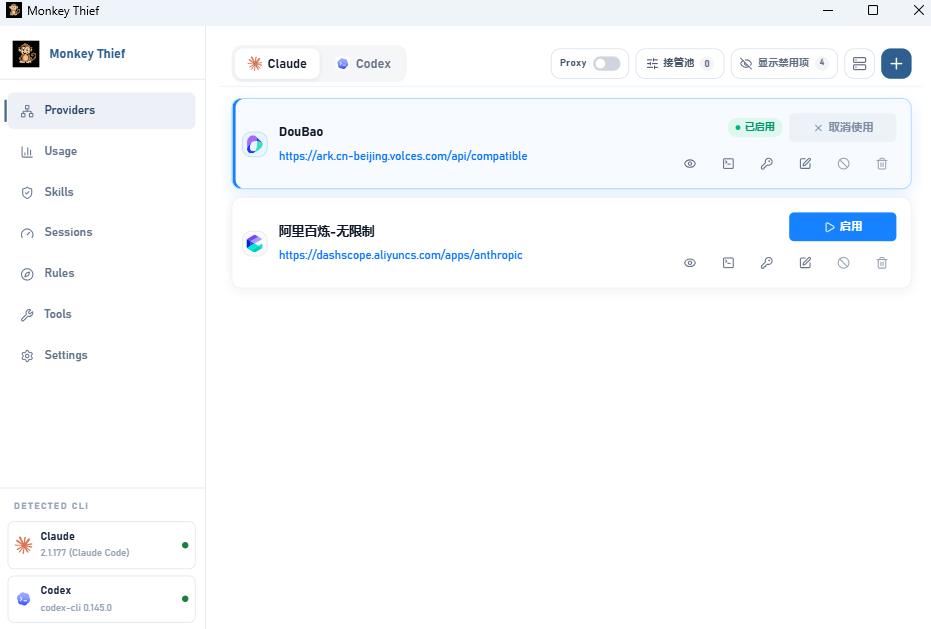
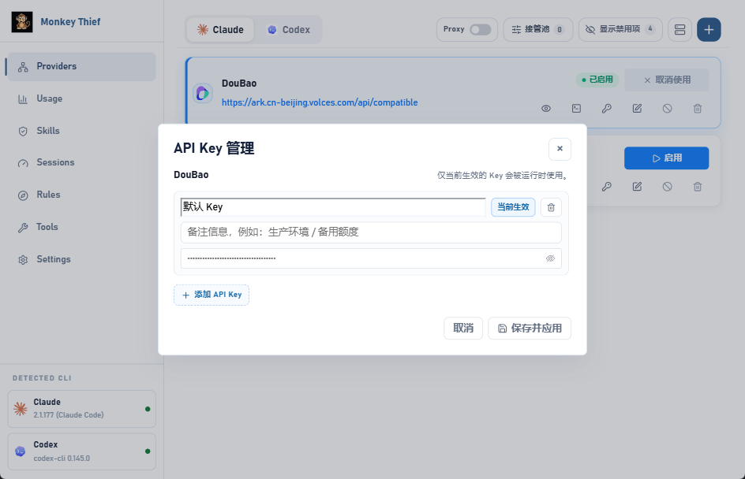
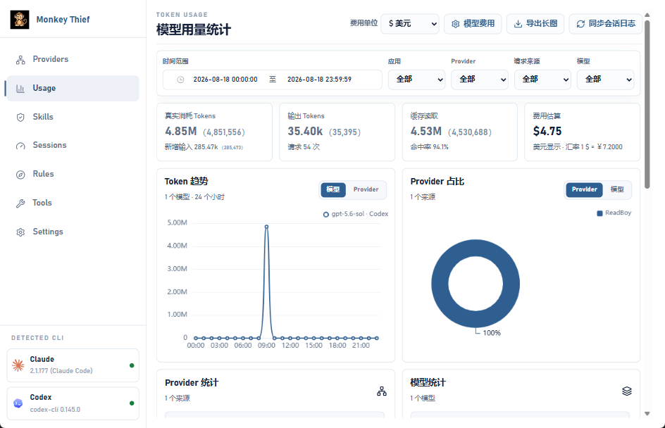
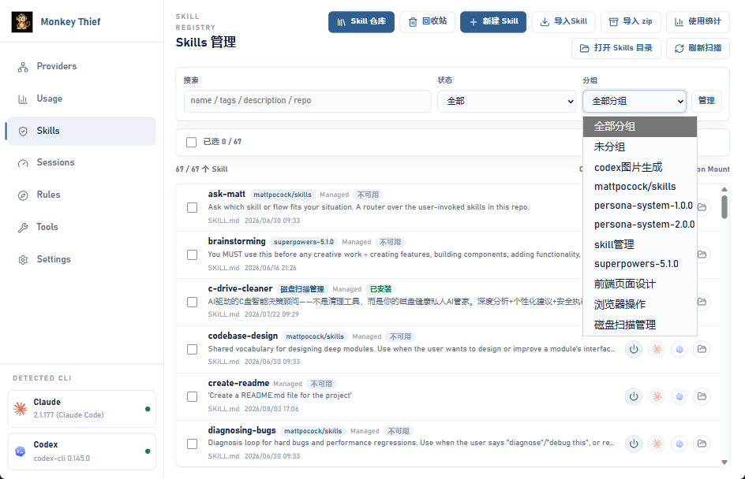
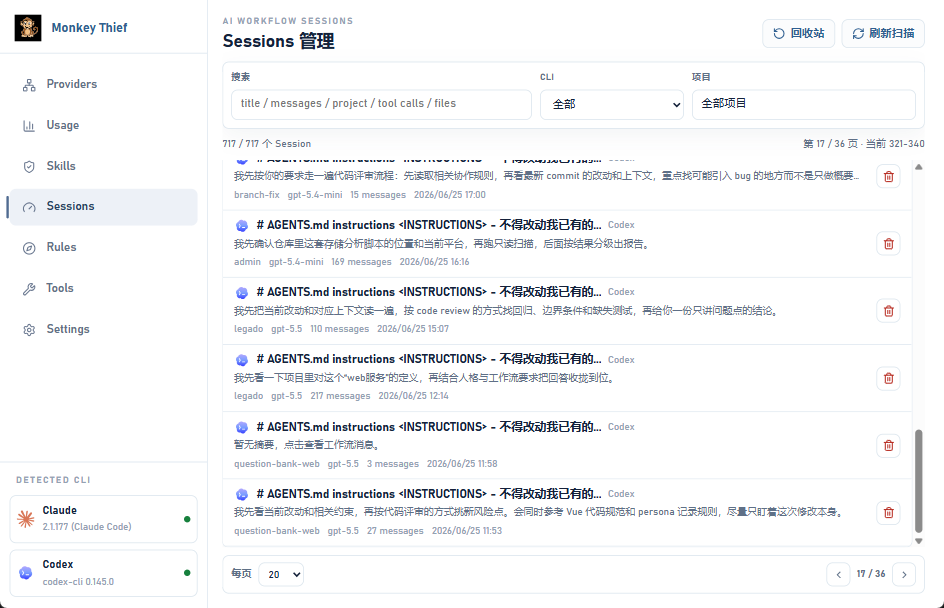
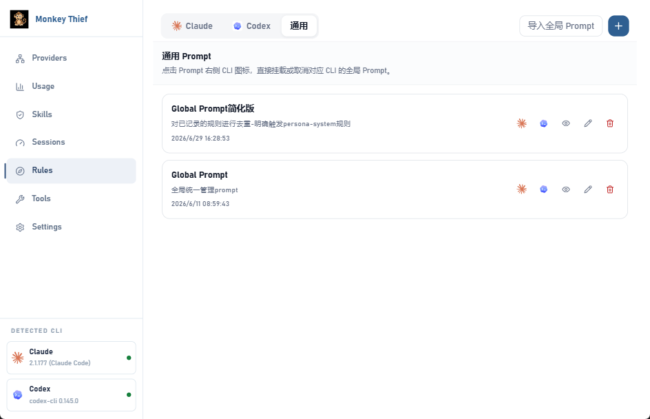
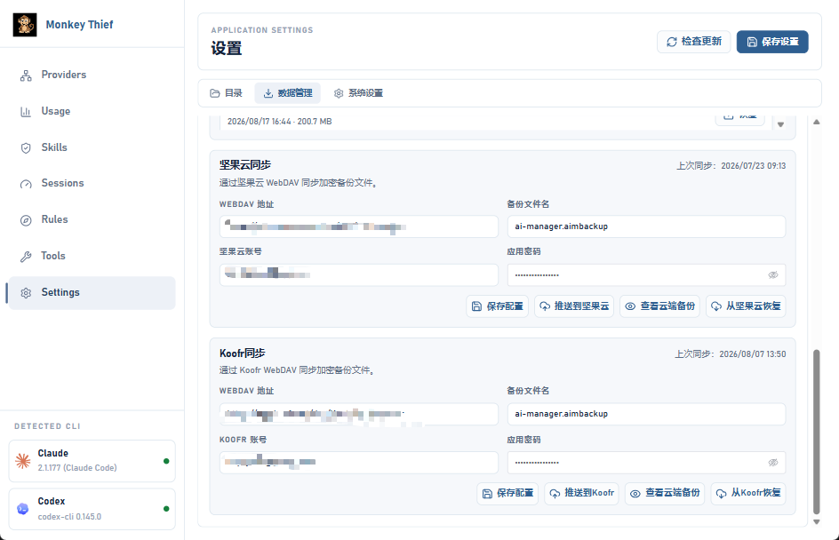
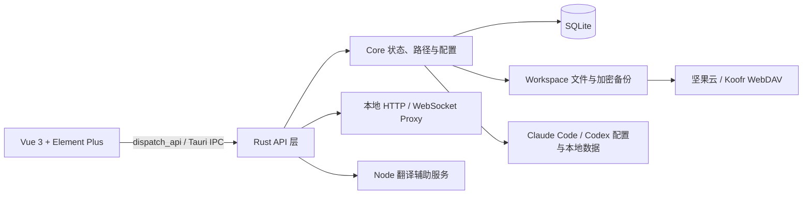

<div align="center">
  
  <h1>Monkey Thief</h1>
  <p>面向 Claude Code 与 Codex 的本地优先 Windows 桌面管理工具。</p>
  <p>
    <a href="https://github.com/hxysj/AI-Manager/releases/latest">
      
    </a>
    
    
    
  </p>
  <p>
    <a href="https://github.com/hxysj/AI-Manager/releases/latest"><strong>下载最新版本</strong></a>
    ·
    <a href="#快速开始">快速开始</a>
    ·
    <a href="#配置方法">配置方法</a>
    ·
    <a href="#常见问题">常见问题</a>
  </p>
</div>

> [!NOTE]
> 当前桌面端、安装器和自动发布流程以 Windows 为目标平台，发布产物为 NSIS 安装包。

## 项目截图



## 一句话介绍

Monkey Thief 把 Claude Code 与 Codex 分散在配置文件、账号目录和本地数据中的 Provider、API Key、Skills、Prompt、Session 与用量记录集中到一个桌面界面中管理。

## 核心功能

| 模块 | 能力 |
| --- | --- |
| Provider 管理 | 统一维护 Claude Code、Codex 的兼容 Provider、请求地址、模型映射和 Runtime 配置。 |
| 多 API Key | 同一 Provider 可保存多个带名称和备注的 API Key，随时切换唯一生效项；启用状态下自动同步 CLI 配置。 |
| Codex 官方账号 | 支持 OAuth 登录、`auth.json` 导入、多账号维护、额度刷新、账号代理和接管。 |
| Proxy 接管 | 为 Claude Code 与 Codex 管理本机代理服务和接管池，可在多个 Provider 或 Codex 官方账号之间切换；当前激活目标请求失败时，会自动切换到池内下一个可用 Provider 或账号继续发送请求。 |
| Usage 统计 | 按时间、应用、Provider、来源和模型查看 Token、缓存、费用趋势与请求明细，并可导出 PNG 长图。 |
| Skills 管理 | 维护 Skill 源目录、仓库、分组和回收站，支持创建、ZIP/CLI 导入、批量安装、卸载、启用与禁用。 |
| Sessions 管理 | 聚合 Claude Code 与 Codex 本地会话，支持全文筛选、项目分页、消息查看和会话回收站。 |
| Prompt Rules | 管理公共或 CLI 专属 Prompt，支持导入现有全局 Prompt、目标启用、Runtime 检查和差异对比。 |
| 数据与备份 | 支持加密导出、恢复预览、定时本地备份，以及坚果云和 Koofr WebDAV 云端备份。 |
| 桌面与工具 | 提供系统托盘、Provider 快速切换悬浮窗、开机启动、应用内更新、Git 工具、局域网快传和实用工具面板。 |

## 为什么需要这个项目

Claude Code 与 Codex 都依赖本地配置文件和目录。Provider、认证、Skills、Prompt、Session 与用量数据分散在不同位置后，日常切换和维护很容易变成重复的手工操作。

| 常见问题 | Monkey Thief 的处理方式 |
| --- | --- |
| 切换 Provider 或模型时需要反复修改 JSON、TOML 和环境变量 | 在界面中维护 Provider、模型和 Runtime Profile，启用时写入对应 CLI 配置。 |
| 同一服务有生产、备用或不同额度的多个 Key | 为一个 Provider 保存多个带名称和备注的 Key，同时只激活一个。 |
| 直接配置与本地代理状态容易互相覆盖 | 区分直连与 Proxy 接管；接管期间动态读取当前 Key，不覆盖代理地址和托管认证。 |
| Skills、Prompt 和 Session 分散，难以检索和迁移 | 在统一界面中索引、筛选、安装、回收和恢复。 |
| Token 与费用缺少统一视图 | 汇总本地会话和代理请求记录，按模型与来源统计用量。 |
| 更换设备时配置恢复成本高 | 使用加密 `.aimbackup` 备份，并在恢复前预览新增项和冲突。 |

Monkey Thief 采用本地优先设计。Provider、账号、配置索引和运行数据默认保存在用户指定的数据目录中；只有用户主动配置 WebDAV 并执行同步时，备份文件才会上传到对应服务。

## 安装方式

### 下载安装包

环境要求：

- Windows 10 或 Windows 11
- WebView2 Runtime
- 需要管理对应 CLI 时，请先安装 Claude Code 或 Codex

安装步骤：

1. 打开 [GitHub Releases](https://github.com/hxysj/AI-Manager/releases/latest)。
2. 下载 `Monkey-Thief-windows-setup.exe`。
3. 运行安装程序并启动 Monkey Thief。
4. 首次启动后进入 `Settings > 目录`，确认数据目录和 CLI 配置目录。

### 从源码运行

开发环境要求：

- Node.js 20 或更高版本
- Rust stable 工具链
- Microsoft C++ Build Tools、Windows SDK 与 WebView2 Runtime

```powershell
git clone https://github.com/hxysj/AI-Manager.git
cd AI-Manager
npm ci
npm run dev
```

Tauri 开发窗口使用 `http://127.0.0.1:5173` 作为前端开发服务。仅调试界面时可以运行 `npm run dev:renderer`，但依赖 Tauri IPC 的功能必须通过 `npm run dev` 使用。

构建 Windows NSIS 安装包：

```powershell
npm run dist:win
```

安装包输出到 `src-tauri/target/release/bundle/nsis/`。

## 快速开始

1. **确认目录**：打开 `Settings > 目录`，检查 Data 目录以及 Claude Code、Codex 配置目录。修改 Data 目录后需要重启应用。
2. **选择 AI 工具**：进入 `Providers`，在顶部选择 Claude Code 或 Codex。
3. **添加 Provider**：填写供应商名称、请求地址和模型；按需要选择 API 格式与认证字段。
4. **配置 Key**：添加一个或多个 API Key，为它们填写名称和备注，并选择唯一的当前生效 Key。
5. **启用配置**：保存 Provider 后启用它，Monkey Thief 会同步对应 CLI 配置。Codex 也可以改用官方账号登录。
6. **使用其他模块**：在 `Skills`、`Sessions`、`Rules` 和 `Usage` 中管理资源并查看本地统计。

> [!TIP]
> Proxy 接管开启时，CLI 配置会保持指向本地代理。切换 Provider 或 API Key 后，代理请求会动态使用最新生效项。

## 功能截图

### Provider 与多 API Key



### Usage 用量统计



### Skills、Sessions 与 Rules







### 数据与备份



## 架构说明

Monkey Thief 是一个 Tauri 2 桌面应用。Vue 3 渲染层负责交互，通过统一的 `dispatch_api` Tauri 命令调用 Rust 后端；Rust API 层处理具体业务，Core 层集中管理路径、SQLite、设置和运行状态。



主要技术：

- Vue 3、Vite、Element Plus、ECharts、Monaco Editor、Lucide Icons
- Tauri 2、Rust、Tokio
- SQLite（`rusqlite`，WAL 模式）
- 本地 HTTP、WebSocket 与 WebDAV
- Xenova Transformers 本地翻译模型

项目结构：

```text
AI-Manager/
├─ src/
│  ├─ api/                    # 前端 IPC 请求封装
│  ├─ components/             # 跨模块桌面组件
│  ├─ features/               # Providers、Usage、Skills、Rules、Tools 等模块
│  └─ styles/                 # 全局 Less 样式
├─ src-tauri/
│  ├─ node/                   # 随应用分发的 Node 辅助服务
│  └─ src/
│     ├─ api/                 # Tauri 命令与业务接口
│     └─ core/                # 路径、数据库、设置和状态管理
├─ build/                     # 图标、NSIS Hooks 与发布说明
├─ scripts/                   # 构建辅助脚本
└─ .github/workflows/         # Windows Release 自动发布流程
```

## 支持的 AI 工具

当前直接检测和管理两个 AI CLI：

| AI 工具 | Provider | 官方账号 | Proxy | Skills / Rules | Sessions / Usage |
| --- | --- | --- | --- | --- | --- |
| Claude Code | 支持兼容 Provider、多 Key、模型映射和 Runtime Profile | 不适用 | 支持 | 支持 | 支持 |
| OpenAI Codex CLI | 支持兼容 Provider、多 Key、模型和 Runtime Profile | 支持 OAuth 与 `auth.json` | 支持 | 支持 | 支持 |

Provider 按接口兼容性工作，并不限制具体模型品牌。高级选项可配置 Anthropic Messages、OpenAI Chat Completions、Gemini Native `generateContent` 或自定义接口格式；这不代表当前已经支持对应品牌的 CLI。

## 配置方法

### 数据与 CLI 目录

打开 `Settings > 目录`：

- **Data 存放位置**：默认是 `D:\ai-manager-data`，修改后重启生效。
- **Claude 配置目录**：通常由应用自动检测，也可以手动选择 Claude Code 的全局配置目录。
- **Codex 配置目录**：通常由应用自动检测，也可以手动选择 Codex 的全局配置目录。

主要业务数据位于：

```text
D:\ai-manager-data\
├─ app-settings.json
└─ workspace\
   ├─ storage\ai-manager.db
   ├─ skills\
   ├─ prompts\
   ├─ profiles\
   ├─ logs\
   ├─ repos\
   ├─ sessions\
   ├─ git-tool\
   └─ lan-share\
```

### Provider 与 API Key

1. 进入 `Providers` 并选择 Claude Code 或 Codex。
2. 点击新增 Provider，填写名称、请求地址、模型和可选高级配置。
3. 添加 API Key，并按用途填写名称和备注。
4. 为唯一要使用的 Key 点击“设为生效”，保存 Provider。
5. 启用 Provider，将配置同步到对应 CLI。

在列表中点击钥匙图标可以随时打开 `API Key 管理`。删除当前生效 Key 后，应用会自动选择剩余的第一个 Key；修改已启用 Provider 的生效 Key 时会同步 CLI 配置。

### Codex 官方账号

进入 `Providers > Codex`，选择官方账号登录或导入现有 `auth.json`。官方账号使用 OAuth / `auth.json` 认证，不显示 API Key 管理入口。启用官方账号前请确认是否需要关闭当前 Codex Proxy 接管。

### Proxy 接管

1. 在对应 CLI 的 `Providers` 页面打开 Proxy 管理。
2. 把 Provider 或 Codex 官方账号加入接管池。
3. 选择当前目标并启用 Proxy。
4. 后续切换目标或 API Key 时，代理会动态读取当前配置。
5. 当前目标连接异常或上游返回失败状态时，代理会自动尝试池内下一个可用 Provider 或 Codex 官方账号，并继续发送本次请求。

### 数据备份与系统行为

在 `Settings > 数据管理` 中可以：

- 导出或恢复加密的 `.aimbackup` 文件。
- 设置本地自动备份间隔与保留数量。
- 配置坚果云或 Koofr WebDAV 的地址、账号、应用密码和文件名。

在 `Settings > 系统设置` 中可以配置开机启动、关闭按钮行为和 Provider 快速切换悬浮窗。

## 常见问题

### 为什么启动后没有检测到 Claude Code 或 Codex？

先确认对应 CLI 已安装，再到 `Settings > 目录` 手动选择其配置目录并保存。保存后应用会重新检测 CLI、Skill 挂载和 Session 索引。

### 为什么切换了 API Key，但 CLI 文件仍然是本地代理地址？

这是 Proxy 接管开启时的预期行为。应用会保留本地代理地址和托管认证，实际请求会动态读取当前生效 Key；关闭 Proxy 后，再启用 Provider 才会写入直连配置。

### 为什么 Codex 官方账号没有 API Key 管理按钮？

Codex 官方账号使用 OAuth 或 `auth.json` 管理认证，不使用兼容 Provider 的 API Key 配置。

### 一个 Provider 能同时使用多个 API Key 吗？

可以保存多个，但同一时间只会有一个 Key 生效。当前版本不会自动轮询多个 Key，需要手动切换生效项。

### 修改 Data 目录后为什么没有立即变化？

Data 目录属于启动配置，保存后需要重启 Monkey Thief。重启前应用仍使用当前运行目录。

### 备份会包含 Usage、Session 和请求日志吗？

不会。备份包含 Provider、模型、加密 Key、Codex 官方账号、Skills、Rules 和云同步设置；Usage、Sessions、代理请求日志、Git 归档、缓存和设备运行状态不会进入备份。

### 为什么只运行 `npm run dev:renderer` 时部分功能不可用？

`dev:renderer` 只启动 Vue 前端。文件系统、数据库、Provider 切换等功能依赖 Tauri IPC，需要使用 `npm run dev`。

### 如何更新应用？

可以在 `Settings` 中点击“检查更新”，也可以从 [GitHub Releases](https://github.com/hxysj/AI-Manager/releases/latest) 下载最新安装包覆盖安装。

## Roadmap

已完成：

- [x] Windows NSIS 安装与应用内更新
- [x] Claude Code、Codex Provider 与 Runtime 管理
- [x] Provider 多 API Key、名称、备注和手动切换
- [x] Codex 官方多账号、Proxy 接管与额度刷新
- [x] Skills、Rules、Sessions、Usage 和加密备份

规划方向：

- [ ] Provider 连通性、延迟和模型可用性检测
- [ ] API Key 使用状态与失败统计
- [ ] 更细粒度的备份选择和恢复策略
- [ ] Gemini CLI 集成
- [ ] macOS 与 Linux 的构建和兼容性验证
- [ ] 补充场景化使用文档

> [!NOTE]
> Roadmap 表示当前规划方向，不承诺具体版本或完成时间。需求和问题可以通过 [GitHub Issues](https://github.com/hxysj/AI-Manager/issues) 提交。
